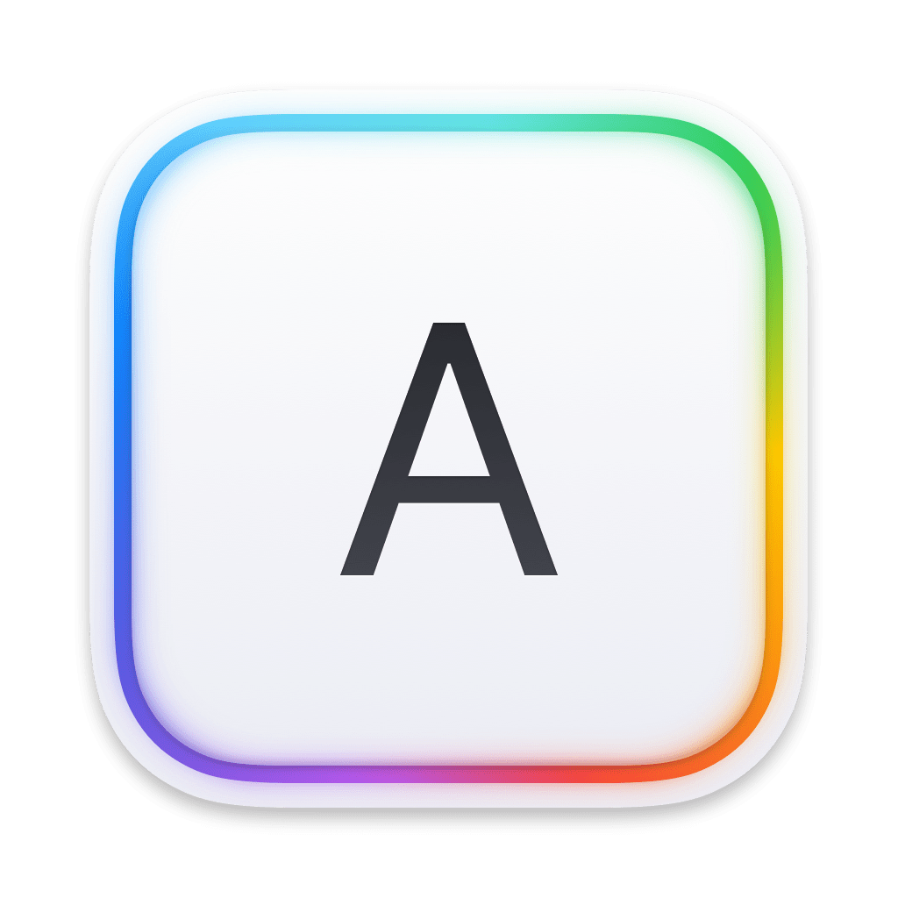

    
      

# KeyboardKit Binaries

This repository is used to host SDK artifacts & dSYMs for [KeyboardKit][Repository]. Each release tag matches an SDK version.

## Website

The [KeyboardKit website][Website] has information about the SDK, a blog with the latest news and updates, pricing info, etc.

## Project

The [KeyboardKit repository][Repository] has a Swift Package that can be used to create keyboard apps for all Apple platforms.

## Contact

Feel free to reach out if you have any questions:

* Website: [keyboardkit.com][Website]
* E-mail: [info@keyboardkit.com][Email]
* Bluesky: [@keyboardkit.bsky.social][Bluesky]
* Mastodon: [@keyboardkit@techhub.social][Mastodon]

[Email]: mailto:info@keyboardkit.com
[Website]: https://keyboardkit.com
[Repository]: https://github.com/keyboardkit/keyboardkit

[Binaries-Repo]: https://github.com/keyboardkit/KeyboardKit-Binaries/
[Documentation]: https://docs.keyboardkit.com
[Documentation-Repo]: https://github.com/keyboardkit/KeyboardKit-Documentation/
[Bluesky]: https://bsky.app/profile/keyboardkit.bsky.social
[Mastodon]: https://techhub.social/@keyboardkit
